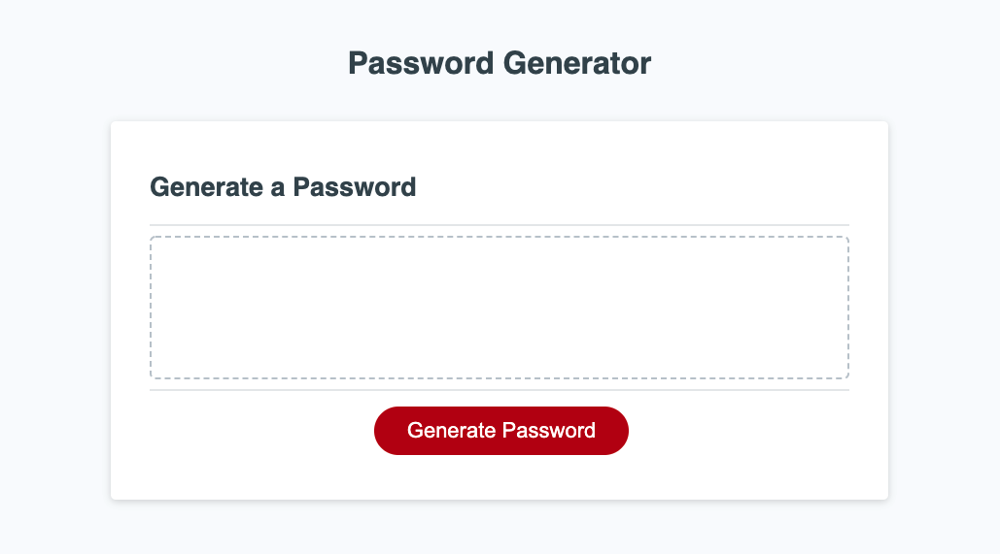
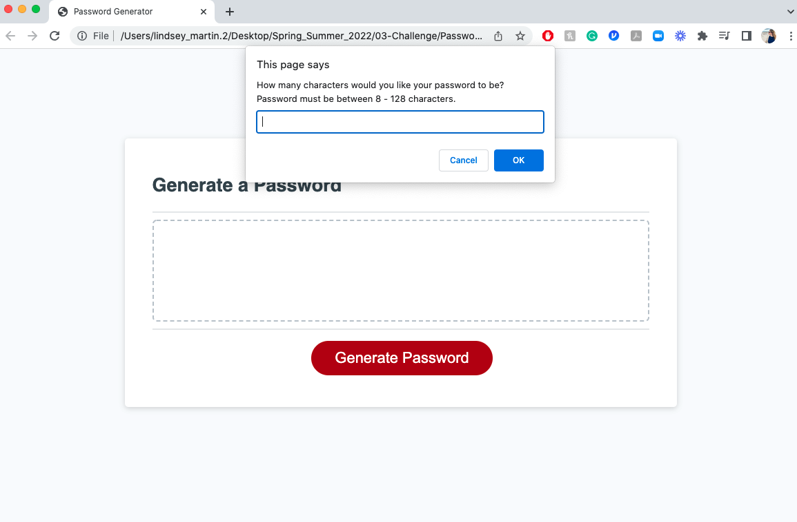
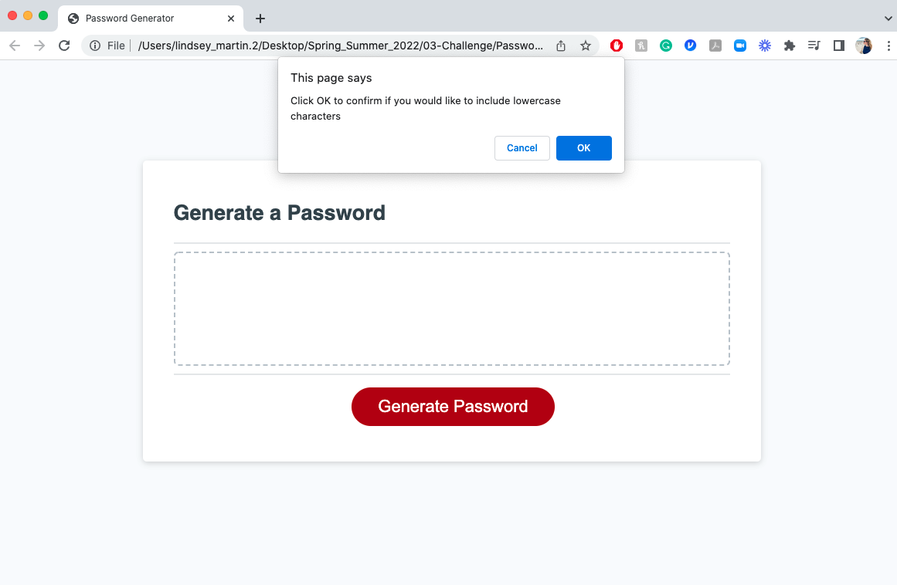
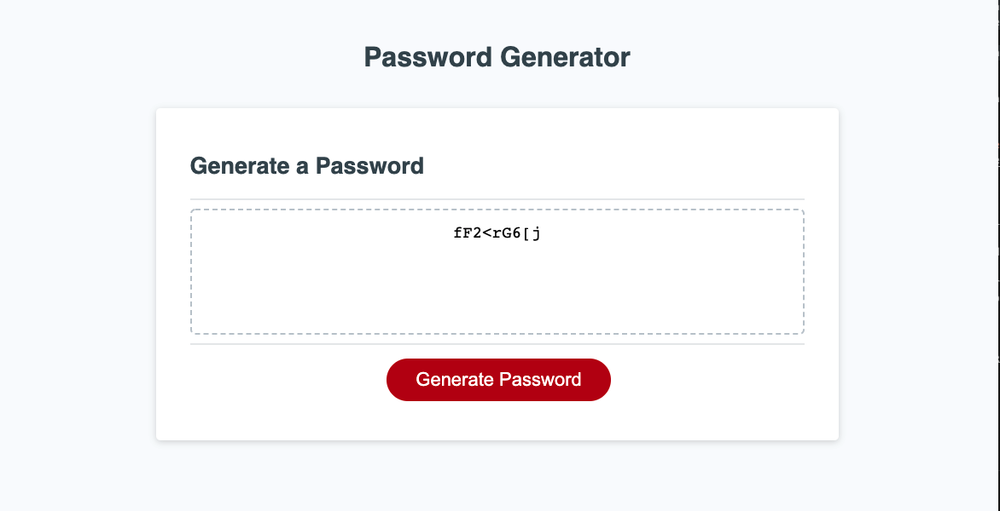

# Password Generator Challenge JS

 As a user, I want to randomly generate a password that meets certain criteria so I can create a strong password that provides greater security.
 A user needs a new, secure password when they  click the button to generate a password.
  A user should be presented with a series of prompts for password criteria when they are prompted for password criteria.
 A user can select which criteria to include in the password when they are prompted for the length of the password.
 A user can choose a length of at least 8 characters and no more than 128 characters when they are prompted for character types to include in the password.
  A user can choose lowercase, uppercase, numeric, and/or special characters when navigating through each prompt. 
 A user should have their input validated and at least one character type should be selected after all prompts are answered. 
 A user should see a password generated that matches the selected criteria when the password is generated.
 A user should see the he password displayed in an alert OR written to the page.

 Link to view <a href="https://lemming97.github.io/Password_Generator/">Password Generator</a>

 
 
 
 